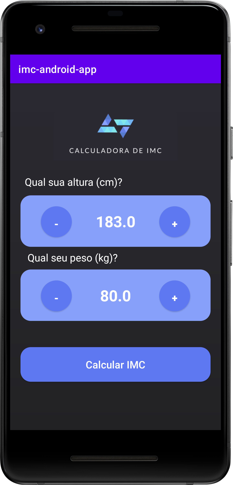
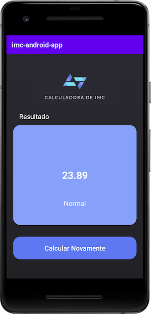

# imc-app-adroid

<h2> IMC ANDROID APP </h2>

<h1 align="center">
    
🔗 CALCULADORA IMC

</h1>

🚀 Aplicação Android para calcular o Indice de Massa Corporal.

<h1 align="center">
  
  
</h1>

### 🛠 Tecnologias

As seguintes ferramentas foram usadas na construção do projeto:

- [AndroidStudio](https://developer.android.com/studio/)
- [Kotlin](https://kotlinlang.org/)

Feito com ❤️ por Fran Mazzarotto
